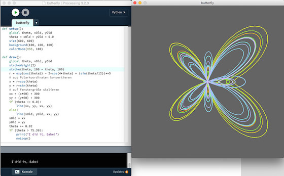

# Anschauliche Mathematik: Die Schmetterlingskurve

Seit ich Ende der 1980er Jahre mit meinem damals hochmodernen [Atari Mega&nbsp;ST][1] erste Schritte mit einem graphikfähigen Personalcomputer unternommen hatte, habe ich die Schmetterlingskurve immer wieder als Test für die Graphikfähigkeit und Schnelligkeit von Programmiersprachen und Rechnern benutzt. Sie wird in [Polarkoordinaten][2] beschrieben und ihre Formel ist (in Python):

~~~python
r = exp(cos(theta)) - 2*cos(4*theta) + (sin(theta/12))**5
~~~

Die Gleichung ist hinreichend kompliziert um selbst in C geschriebene Routinen auf meinen damals unglaubliche 8 MegaBit schnellen Atari alt aussehen zu lassen. Rechenzeiten von 10 - 20 Minuten waren keine Seltenheit. Heute dagegen muß man den Rechner schon künstlich verlangsamen, damit man sieht, wie sich die Kurve aufbaut. Denn sonst erscheint sofort die fertige Kurve, um die sinnliche Erfahrung, wie diese entsteht, wird man betrogen. Daher habe ich sie in *Processing.py* innerhalb der `draw()`-Schleife zeichnen lassen, wobei die Schleifenvariable `theta` bei jedem Durchlauf um `0.02` erhöht wurde.

Der Code ist -- dank Processing.py -- wieder von erfrischender Einfachheit und Kürze:

~~~python
def setup():
    global theta, xOld, yOld
    theta = xOld = yOld = 0.0
    size(600, 600)
    background(100, 100, 100)
    colorMode(HSB, 100)
    
def draw():
    global theta, xOld, yOld
    strokeWeight(2)
    stroke(theta, 100 - theta, 100)
    r = exp(cos(theta)) - 2*cos(4*theta) + (sin(theta/12))**5
    # aus Polarkoordinaten konvertieren
    x = r*cos(theta)
    y = r*sin(theta)
    # auf Fenstergröße skalieren
    xx = (x*60) + 300
    yy = (y*60) + 300
    if (theta == 0.0):
        point(xx, yy)
    else:
        line(xOld, yOld, xx, yy)
    xOld = xx
    yOld = yy
    theta += 0.02
    if (theta > 75.39):
        print("I did it, Babe!")
        noLoop()
~~~

In `setup()` ist eigentlich nur bemerkenswert, daß ich nach der Festlegung des grauen Hintergrunds (noch als RGB), den `colorMode` auf HSB geändert habe. Damit lassen sich nämlich recht einfach diverse Farbeffekte erzielen. Ich habe dabei den *Hue*-Wert in Abhängigkeit von `theta` gesetzt, die Sättigung auf `100 - theta` und die *Brightness* konstant bei 100 belassen. Da `theta` nie größer als *75,39* wird, wird es also auch nie größer als 100 und damit sind diese Umrechnungen gefahrlos.

Damit erreicht man, daß zu Beginn, wo die Sättigung noch ziemlich voll ist, die Zeichnung mit einem satten rot beginnt, während im Laufe der Iteration die weiteren Farben immer blasser werden. Ich fand dies das ästhetisch anspruchvollste Ergebnis, aber um das selber nachvollziehen zu können, solltet Ihr ruhig damit experimentieren, zum Beispiel mit `stroke(theta, 100, 100)` oder `stroke(100-theta, theta, 100)` oder was immer Ihr wollt.

Ihr bekommt so diesen wunderschönen Schmetterling auf den Monitor gezeichnet:

Um die Entstehung der Kurve zu verstehen, empfiehlt *Stan Wagon*[^wagon93], nacheinander folgende Formlen plotten zu lassen:

[^wagon93]: Stan Wagon: *Mathematica® in Aktion*, Heidelberg (Spektrum Akademischer Verlag) 1993

In Polarkoordinaten:

~~~python
r = exp(cos(theta))  # ergibt eine Art Kreis
r = -2*cos(4*theta)  # ergibt eine Art Blume
r = exp(cos(theta)) - 2*cos(4*theta)  # ergibt einen sehr einfachen Schmetterling
~~~

Dann in kartesischen Koordinaten:

~~~python
x = -2*cos(4*theta)
y = -sin(theta/12)**5
~~~

Und dann ruhig auch noch einmal (wieder in Polarkoordinaten):

~~~python
r = exp(cos(theta)) - 2*cos(4*theta) - (sin(theta/12))**5
~~~

Ihr seht dann, daß es eigentlich unerheblich ist, ob Ihr den Störungsgteil der Formel addiert oder subtrahiert: Der Schmetterling ist nahezu identisch, lediglich an der anderen Farbgebung erkennt Ihr, daß es zwei verschiedene Formeln sind.

Die Schmetterlingskurve und ähnliche Kurven wurden von *Temple Fay*[^fay89] an der Universität von Southern Mississpi entwickelt. Sie eignen sich vorzüglich zum Experimentieren. So weist Pickover[^pick92] darauf hin, daß die Kurve

[^fay89]: Temple Fay: *The Butterfly Curve*, American Math. Monthly, 96(5); 442-443
[^pick92]: Clifford A. Pickover: *Mit den Augen des Computers. Phantastische Welten aus dem Geist der Maschine*, München (Markt&Technik) 1992, S. 41ff.

~~~python
r = exp(cos(theta)) - 2.1*cos(6*theta) + sin(theta/30)**7
~~~

eine bedeutend größere Wiederholungsperiode besitzt. Ihr solltet Euch auch das ruhig einmal ansehen. Interessante Vergleiche mit der Originalschmetterlingskurve können Ihr auch ziehen, wenn Ihr mit

~~~python
r = exp(cos(2*theta)) - 1.5*cos(4*theta)
~~~

eine ganz simple Form des Schmetterlings zeichnen lasst. Denn die heutigen Rechner sind schließlich hinreichend schnell, daß Ihr nicht mehr minuten- oder gar stundenlang auf ein Ergebnis warten müßt und zum anderen lädt die Möglichkeit des schnellen Skizzierens mit der Processing-IDE geradezu zu eigenen Experimenten ein.

[1]: https://de.wikipedia.org/wiki/Atari_ST
[2]: https://de.wikipedia.org/wiki/Polarkoordinaten
