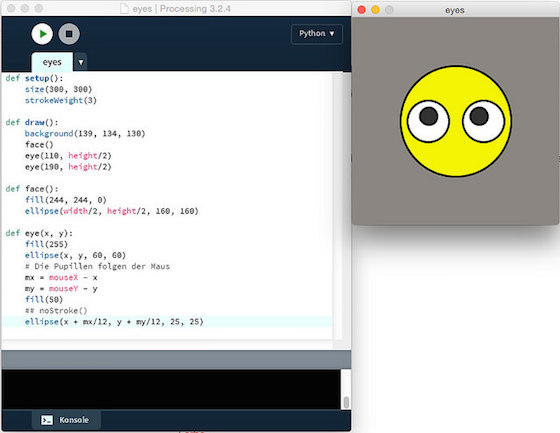

# For Your Eyes Only – Processing.py zieht Kreise

Nachdem ich in den vorherigen Tutorials zu Processing.py, dem Python-Mode von Processing, schon mit Punkten und Linien hantiert habe, wird es nun Zeit, etwas mit Kreisen und Ellipsen anzustellen (sie werden in Processing mit dem gleichen Befehl erzeugt).

Ein einfacher Kreis ist schnell erzeugt. Mit diesem kleinen *Sketch* malt Ihr einen grellroten Kreis auf schwarzem Grund:

~~~python
def setup():
    size(500, 500)

def draw():
    background(0)
    fill(255, 0, 0)
    ellipse(width/2, height/2, 450, 450)
~~~

Die Funktion `ellipse()` besitzt vier Parameter, die ersten beiden sind die x- und y-Koordinaten, die per Default die Mitte des Kreises oder der Ellipse bezeichnen, die beiden anderen sind der Durchmesser des Kreises oder der Ellipse (auch wenn sie in der Literatur oft mit `r` bezeichnet werden, nicht der Radius). Bei einem Kreis müssen die letzten beiden Parameter immer den gleichen Wert besitzen. Wenn Ihr aber zum Beispiel die Funktion mit

~~~python
    ellipse(width/2, height/2, 350, 450)
~~~

oder

~~~python
    ellipse(width/2, height/2, 450, 350)
~~~

aufruft, dann seht Ihr, wie aus den Kreisen Ellipsen werden.

Nun steht Processing aber für Interaktivität. Daher möchte ich aus fünf Kreisen ein Gesicht zaubern, dessen Pupillen dem Mauszeiger folgen. Auch dieser *Sketch* ist hübsch kurz geraten:

~~~python
def setup():
    size(300, 300)
    strokeWeight(3)

def draw():
    background(139, 134, 130)
    face()
    eye(110, height/2)
    eye(190, height/2)

def face():
    fill(244, 244, 0)
    ellipse(width/2, height/2, 160, 160)

def eye(x, y):
    fill(255)
    ellipse(x, y, 60, 60)
    # Die Pupillen folgen der Maus
    mx = mouseX - x
    my = mouseY - y
    fill(50)
    ellipse(x + mx/12, y + my/12, 25, 25)
~~~

Es wäre nicht wirklich notwendig gewesen, aber der Modularität willen habe ich das Zeichnen des Gesichtes in die Funktion `face()` und das Zeichnen der Augen in die Funtion `eye()` ausgelagert. Mit den Werten in dem `ellipse()`-Aufruf bei den Augen habe ich solange experimentiert, bis sie meinen Vorstellungen entsprachen. Nun sieht aber alles aus wie in dem obigen Screenshot.

## Credits

Die Idee zu den Augen habe ich einem [(Java-) Processing-Tutorial][3] von *Thomas Koberger* entnommen, das ich variiert und nach Processing.py übertragen habe. Auf [seinen Seiten][4] findet man übrigens noch viele weitere, interessante und lehrreiche Tutorials, so daß ich Euch einen Besuch dort empfehle.

Für die Farben habe ich mal wieder wild nach einer [Seite mit Farbpaletten][5] gegoogelt und fand die gefundene dann zwar nicht unbedingt schön, aber ungemein praktisch.

[3]: https://lernprocessing.wordpress.com/2010/01/10/funktionen/
[4]: https://lernprocessing.wordpress.com/2010/01/18/processing-links/
[5]: http://www.farb-tabelle.de/de/farbtabelle.htm