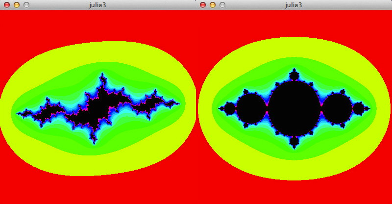

# Julia-Menge

Die [Julia-Menge](https://de.wikipedia.org/wiki/Julia-Menge) wurde 1918 von den beiden französischen Mathematikern *Gaston Maurice Julia* (nachdem sie benannt wurde) und *Pierre Fatou* (dessen Zugang heute die meisten Lehrbücher folgen) unabhängig voneinander beschrieben. Sie steht im engen Zusammenhang zur im letzten Abschnitt beschriebenen [Mandelbrot-Menge](mandelbrot.md). Während die Mandelbrot-Menge, die Menge aller komplexen Zahlen *c* ist, die der iterierten Gleichung

$$
\begin{align}
z_{0} & = 0\\\\
z_{n+1} & = z_{n}^{2}+c\\\\
\end{align}
$$

folgen, ist bei der Julia-Menge *c* konstant:

$$
\begin{align}
z_{n}^{2}+c\\\\
\end{align}
$$

Die Mandelbrot-Menge ist also eine Beschreibungsmenge aller Julia-Mengen. Jedem Punkt *c* der komplexen Zahlenebene entspricht eine Julia-Menge. Eigenschaften der Julia-Menge lassen sich an der Lage von *c* relativ zur Mandelbrot-Menge beurteilen: Wenn der Punkt *c* Element der Mandelbrot-Menge ist, dann ist die Julia-Menge zusammenhängend. Andernfalls ist sie eine Cantormenge unzusammenhängender Punkte. Ist der Imaginärteil *ci = 0*, dann ist die Julia-Menge symmetrisch (vlg. Abbildung links oben), ansonsten kann sie alle möglichen Formen annehmen.

## Julia-Menge interaktiv

Ich habe die obigen Bilder mit diesem Programm erzeugt, daß den Parameter *c* in Abhängigkeit von der Mausposition setzt:

~~~python
left   = -2.0
right  = 2.0
bottom = 2.0
top    = -2.0
maxlimit = 3.0
maxiter = 25

def setup():
    size(400, 400)
    background("#555ddd")
    colorMode(HSB, 1)

def draw():
    cr = map(mouseX, 0, width, left, right)
    ci = 0
    # ci = map(mouseY, 0, height, top, bottom)
    c = complex(cr, ci)
    for x in range(width):
        zr = left + x*(right - left)/width
        for y in range(height):
            zi = bottom + y*(top - bottom)/height
            z = complex(zr, zi)
            i = 0
            for i in range(maxiter):
                if abs(z) > maxlimit:
                    break
                z = (z**2) + c
                if i == (maxiter-1):
                    set(x, y, color(0))
                else:
                    set(x, y, color(sqrt(float(i)/maxiter), 100, 100))
    println("cr = " + str(cr))
    println("ci = " + str(ci))
~~~

Kommentiert man die Zeile `ci = 0` aus und aktiviert stattdessen die auskommentierte Zeile darunter, erhält man (theoretisch) alle Julia-Mengen, sonst erzeugt das Programm nur die symmetrischen. Richtig flüssig ist die Animation allerdings nicht, Processing.py gerät -- zumindest auf meinem betagten MacBook Pro -- schon ganz schön ins Stottern.

## Julia-Menge animiert

Das gilt auch für das zweite Programm, das die Parameter der Julia-Menge anhand zweier Sinus- (wahlweise auch Cosinus-) Funktionen periodisch durchläuft:

~~~python
left   = -2.0
right  = 2.0
bottom = 2.0
top    = -2.0
maxlimit = 3.0
maxiter = 25

def setup():
    size(400, 400)
    background("#555ddd")
    colorMode(HSB, 1)

def draw():
    # cr = 0
    cr = 2*sin(frameCount)
    ci = 0
    # ci = 2*cos(frameCount)
    c = complex(cr, ci)
    for x in range(width):
        zr = left + x*(right - left)/width
        for y in range(height):
            zi = bottom + y*(top - bottom)/height
            z = complex(zr, zi)
            i = 0
            for i in range(maxiter):
                if abs(z) > maxlimit:
                    break
                z = (z**2) + c
                if i == (maxiter-1):
                    set(x, y, color(0))
                else:
                    set(x, y, color(sqrt(float(i)/maxiter), 100, 100))
    println("cr = " + str(cr))
    println("ci = " + str(ci))
~~~

Auch hier kommt das Programm ganz schön ins Schwitzen. Das läßt allerdings dem Betrachter Zeit, die Schönheit der Julia-Menge zu bewundern. 