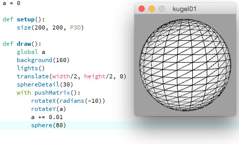

# Kugeln und Kisten

Processing und damit auch Processing.py besitzt die Möglichkeit, sehr einfach 3D-Objekte zu erzeugen, allerdings sind als Primitive nur eine Kugel und eine Kiste (`sphere()` und `box()`) vorgesehen. Als Erstes möchte ich zeigen, wie man schnell eine sich drehende Kugel damit zaubert:

Um mit Processing in drei Dimensionen zu arbeiten, muß man das bei der Initialisierung des Fensters dem Programm mitteilen:

~~~python
def setup():
    size(200, 200, P3D)
~~~

Eigentlich teilt man Processing auch mit, wenn man in zwei Dimensionen hantieren will, nur ist `P2D` einfach der Default und kann entfallen.

Dann besitzt Processing eine einfache Methode, die 3D-Landschaft auszuleuchten, nämlich `lights()`. Und ähnlich wie den Kreisen und Ellipsen ist auch bei einer Kugel per Default, der Ursprung der Koordinaten die Mitte. Daher habe ich mit

~~~python
    translate(width/2, height/2, 0)
~~~

die x- und y-Achsen des Koordinatensystems in die Mitte des Fensters gelegt. Mit `sphereDetail(n)` wird die Anzahl der Dreiecke bestimmt, aus denen die Kugel zusammengesetzt werden soll. Je mehr Dreiecke, desto »runder« die Kugel, aber auch um so größer die Rechenzeit. Bei diesem einfachen Programm spielt das noch keine Rolle, die Zahl `30` ist eher dem Umstand geschuldet, daß die Kugel vor lauter Dreieicken sonst nicht mehr zu erkennen ist.

Und dann kommt wieder das geniale `with`-Statement zu Einsatz: 

~~~python
    with pushMatrix():
        rotateX(radians(-10))
        rotateY(a)
        a += 0.01
        sphere(80)
~~~

Mit `rotateX()` wird die Kugel ein wenig geneigt und mit `rotateY()` dreht sie sich um die eigene Achse. Einfacher kann man eine sich bewegende Kugel in 3D eigentlich gar nicht programmieren.

## Der Quellcode

Hier noch einmal der komplette Quellcode des Sketches zum Nachbauen:

~~~python
a = 0

def setup():
    size(200, 200, P3D)

def draw():
    global a
    background(160)
    lights()
    translate(width/2, height/2, 0)
    sphereDetail(30)
    with pushMatrix():
        rotateX(radians(-10))
        rotateY(a)
        a += 0.01
        sphere(80)
~~~

## Caveat

Jetzt kommt aber das Salz in der Suppe: `box()` wie auch `sphere()` lassen sich nicht mit Texturen versehen. Dafür muß man sich mit Vertizes seine eigenen 3D-Objekte bauen.
