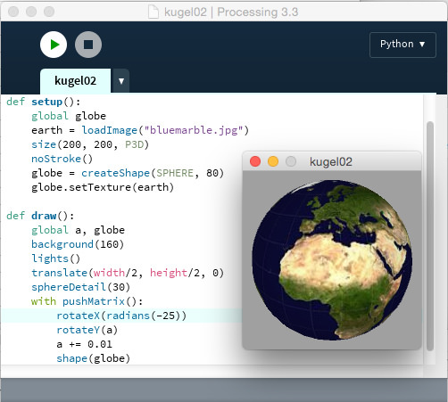

# Und es geht doch: Kugeln und Texturen

Ich hatte doch [hier behauptet](http://py.kantel-chaos-team.de/kugel/), daß man die einfachen 3D-Primitive `sphere()` und `box()` nicht mit Texturen versehen kann und man darum dann eigene 3D-Objekte bauen müsse. Nun gibt es jedoch einen einfachen Weg, diese Beschränkung zu umgehen. Denn der Befehl `createShape()` erzeugt nicht nur ein Objekt, sondern er kann auch Parameter übernehmen. Und so kann man mit

~~~python
earth = loadImage("bluemarble.jpg")
noStroke()
globe = createShape(SPHERE, 80)
globe.setTexture(earth)
~~~

auf einfachste Weise einen *Shape* erzeugen, den man mit Texturen versehen kann.

Hier der vollständige Sketch, der uns diese Erdkugel erzeugt:

~~~python
a = 0

def setup():
    global globe
    earth = loadImage("bluemarble.jpg")
    size(200, 200, P3D)
    noStroke()
    globe = createShape(SPHERE, 80)
    globe.setTexture(earth)

def draw():
    global a, globe
    background(160)
    lights()
    translate(width/2, height/2, 0)
    sphereDetail(30)
    with pushMatrix():
        rotateX(radians(-25))
        rotateY(a)
        a += 0.01
        shape(globe)
~~~
