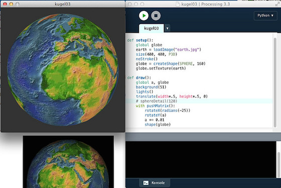

# Und es geht doch: Kugeln und Texturen

Ich hatte doch [hier behauptet](http://py.kantel-chaos-team.de/kugel/), daß man die einfachen 3D-Primitive `sphere()` und `box()` nicht mit Texturen versehen kann und man darum dann eigene 3D-Objekte bauen müsse. Nun gibt es jedoch einen einfachen Weg, diese Beschränkung zu umgehen. Denn der Befehl `createShape()` erzeugt nicht nur ein Objekt, sondern er kann auch Parameter übernehmen. Und so kann man mit

~~~python
earth = loadImage("bluemarble.jpg")
noStroke()
globe = createShape(SPHERE, 80)
globe.setTexture(earth)
~~~

auf einfachste Weise einen *Shape* erzeugen, den man mit Texturen versehen kann.

Hier der vollständige Sketch, der uns diese Erdkugel erzeugt:

~~~python
a = 0

def setup():
    global globe
    earth = loadImage("bluemarble.jpg")
    size(200, 200, P3D)
    noStroke()
    globe = createShape(SPHERE, 80)
    globe.setTexture(earth)

def draw():
    global a, globe
    background(160)
    lights()
    translate(width/2, height/2, 0)
    sphereDetail(30)
    with pushMatrix():
        rotateX(radians(-25))
        rotateY(a)
        a += 0.01
        shape(globe)
~~~

## Und noch eine Textur

Und hier noch einmal die Erdkugel mit einer anderen Textur, die ich [hier gefunden](http://www.inf-schule.de/information/informationsdarstellungxml/darstellunginformation/fallstudie_3dgrafiken/exkurs/farben) habe. Schaut man genau hin, entdeckt man, daß die Erde an der Datumsgrenze einen Riß aufweist -- ein Phänomen, daß ich hin und wieder schon beobachtet, für daß ich allerdings bis jetzt noch keine Erklärung habe.

Der Quellcode wurde nur geringfügig geändert, aber der Vollständigkeit halber hier noch einmal:

~~~python
a = 0

def setup():
    global globe
    earth = loadImage("earth.jpg")
    size(400, 400, P3D)
    noStroke()
    globe = createShape(SPHERE, 160)
    globe.setTexture(earth)

def draw():
    global a, globe
    background(51)
    lights()
    translate(width*.5, height*.5, 0)
    # sphereDetail(120)
    with pushMatrix():
        rotateX(radians(-25))
        rotateY(a)
        a += 0.01
        shape(globe)
~~~
