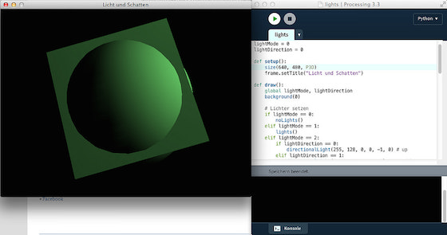

# Licht und Schatten

Bei dreidimensionalen Applikationen gilt für jede Software genau wie im wirklichen Leben: »Ohne Licht sehen Sie nichts!« Das ist bei den spezialisierten Programmen wie [Blender](http://cognitiones.kantel-chaos-team.de/multimedia/computergraphik/3d/blender.html) oder [PoVRay](http://cognitiones.kantel-chaos-team.de/multimedia/computergraphik/3d/povray.html) genau so, wie auch in Processing.py. Daher möchte ich in folgendem Skript zeigen, welche Möglichkeiten der Beleuchtung es in Processing gibt und welche Auswirkung sie auf die Szene haben.

Dazu habe ich eine Kugel verschachtelt in einer Box erzeugt und sie in ein 3D-Fenster gesetzt. Sie ist im Grunde farblos, nur für eine Belichtung (`lights()`) habe ich der Kugel eine hell- und der Box eine dunkelblaue Farbe verpaßt.

Bevor ich die Kugel und die Box zeichnen lasse, überprüfe ich, welche Beleuchtungsfunktion aktuell angewählt ist. Processing kennt sechs Beleuchtungfunktionen. Diese sind

1. `noLights()`: Diese schaltet alle Beleuchtung aus und die dreidimensionalen Objekte wirken zweidimensional. Diese Funktion kann benutzt werden, um dreidimensionale Objekte mit zweidimensionalen Zeichnungen zu kombinieren.
2. `lights()`: Das ist die einfachste Beleuchtungsfunktion, die die Umgebung in ein neutrales, ambientes Licht taucht. Sie kann immer erst einmal für den Test der dreidiemnsionalen Objekte eingesetzt verwendet werden, bevor man sich an spektakulärere Beleuchtungsmodelle wagt.
3. `directionalLight(v1, v2, v3, nx, ny, nz)`: Diese Beleuchtungsfunktion besitzt sechs Parameter. Die ersten drei geben die Farbwerte an (es können je nach gewähltem Farbmode entweder RGB- oder HSB-Werte sein). Die letzten drei Werte geben jeweils die Richtung des Lichtes aus der x-, y, und/oder z-Richtung an. Direkte Richtungen sind `0, -1, 0` nach oben, `0, 1, 0` nach unten, `1, 0, 0` nach rechts und `-1, 0, 0` nach links. Analog sind die Werte für »Licht von vorne« und »Licht von hinten« einzustellen und durch Kombinationen der drei Parameter bekommt man auch Licht aus beliebigen Richtungen.
4. `ambientLight(v1, v2, v3)` taucht die Umgebung in ein ambientes Licht in der mit `v1, v2, v3` spezifizierten Farbe (RGB oder HSB). Ambientes Licht wird meist mit anderen Lichtquellen kombiniert, um zum Beispiel die Schlagschatten der anderen, gerichteten Lichtquellen aufzuhellen.
5. `pointLight(v1, v2, v3, x, y, z)` setzt ein punktförmiges Licht in den Farben `v1, v2, v3` aus der Position `x, y, z`.
6. `spotLight(v1, v2, v3, x, y, z, nx, ny, nz, angle, concentration)` ergibt ein kegelförmiges Licht in den Varben `v1, v2, v3` von der Quelle `x, y, z` in die Richtung `nx, ny, nz` mit dem Winkel `angle` und der Intensität `concentration`.

Alle Beleuchtungsfunktionen müssen innerhalb der `draw()`-Funktion aufgerufen werden. Werden sie stattdessen in der `setup`-Funktion aufgerufen, sind sie nur beim ersten Durchlauf wirksam. Daher habe ich das auch im Sketch so gehalten, wobei je nach gewähltem `lightMode` die Beleuchtung gesetzt wird.

## Licht aus -- Spot an!

Die Beleuchtung kann man während der Sketch läuft mit der Tastatur auswählen. Die Tasten sind sprechend gewählt:

~~~python
def keyPressed():
    global lightMode, lightDirection
    if key == "n":
        lightMode = 0            # no lights
    elif key == "l":
        lightMode = 1            # lights
    elif key == "d":
        lightMode = 2            # directional light
    elif key == "a":
        lightMode = 3            # ambient light
    elif key == "p":
        lightMode = 4            # point light
    elif key == "s":
        lightMode = 5            # spot light
~~~

!!! warning "Warnung"
    Bevor man die Tasten drückt, sollte man darauf achten, daß das Graphikfenster von Processing.py im Vordergrund ist, also den Fokus besitzt. Denn sonst tippt man versehentlich gnadenlos Buchstaben in sein Skript und wundert sich, warum es anschließend nicht mehr läuft. Ich verstehe nicht ganz, warum im Python-Mode das Ausgabefenster beim Start des Programmes nicht automatisch den Fokus bekommt, wie das im Java-Mode von Processing der Fall ist?

Ist das direktionale Licht ausgewählt kann man zusätzlich noch mit den Pfeiltasten die Richtung des Lichtes bestimmen.

## Quellcode

Wenn man bedenkt, daß in diesem Programm doch einiges passiert, ist der Quellcode immer noch sehr kurz. Das Nachvollziehen sollte auch keine besondere Mühe machen, schließlich wird Python ja oft und zu Recht als lauffähiger Pseudocode bezeichnet.

~~~python
lightMode = 0
lightDirection = 0

def setup():
    size(640, 480, P3D)
    frame.setTitle("Licht und Schatten")

def draw():
    global lightMode, lightDirection
    background(0)
    
    # Lichter setzen
    if lightMode == 0:
        noLights()
    elif lightMode == 1:
        lights()
    elif lightMode == 2:
        if lightDirection == 0:
            directionalLight(255, 128, 0, 0, -1, 0) # up
        elif lightDirection == 1:
            directionalLight(0, 255, 0, 1, 0, 0)    # right
        elif lightDirection == 2:
            directionalLight(255, 0, 255, 0, 1, 0)  # down
        elif lightDirection == 3:
            directionalLight(0, 255, 255, -1, 0, 0) # left
    elif lightMode == 3:
        ambientLight(0, 255, 255)
    elif lightMode == 4:
        pointLight(255, 255, 0, 100, height*0.3, 100)
    elif lightMode == 5:
        spotLight(128, 255, 128, 800, 20, 300, -1, .25, 0, PI, 2)
    else:
        noLights()
    
    # Kugel und Box zeichnen
    with pushMatrix():
        translate(width/2, height/2)
        with pushMatrix():
            rotateY(radians(frameCount))
            fill(255)
            if lightMode == 1:
                fill(151, 255, 255)
            noStroke()
            sphere(160)
        with pushMatrix():
            rotateZ(radians(frameCount))
            rotateX(radians(frameCount/2.0))
            fill(255)
            if lightMode == 1:
                fill(0, 0, 139)
            noStroke()
            box(240)
            
def keyPressed():
    global lightMode, lightDirection
    if key == "n":
        lightMode = 0            # no lights
    elif key == "l":
        lightMode = 1            # lights
    elif key == "d":
        lightMode = 2            # directional light
    elif key == "a":
        lightMode = 3            # ambient light
    elif key == "p":
        lightMode = 4            # point light
    elif key == "s":
        lightMode = 5            # spot light
    
    if key == CODED:
        if keyCode == UP:
            lightDirection = 0
        elif keyCode == RIGHT:
            lightDirection = 1
        elif keyCode == DOWN:
            lightDirection = 2
        elif keyCode == LEFT:
           lightDirection = 3
~~~

<iframe style="width:120px;height:240px;" marginwidth="0" marginheight="0" scrolling="no" frameborder="0" src="//ws-eu.amazon-adsystem.com/widgets/q?ServiceVersion=20070822&OneJS=1&Operation=GetAdHtml&MarketPlace=DE&source=ss&ref=as_ss_li_til&ad_type=product_link&tracking_id=derschockwell-21&marketplace=amazon&region=DE&placement=1849517940&asins=1849517940&linkId=f158448c6496c6a5a0b1be0bfe476017&show_border=true&link_opens_in_new_window=true"></iframe>

## Credits

Dieses Beispielprogramm folgt einer Idee aus dem Bucn »[Processing 2: Creative Programming Cookbook][amazon]« von *Jan Vantomme*. Ich habe sie geringfügig überarbeitet und vom Processing 2 Java-Mode in den Python-Mode von Processing 3 umgeschrieben.

## Literatur

- Jan Vantomme: *[Processing 2: Creative Programming Cookbook][amazon]*, Birmingham *(Packt Publishing)*, 2012

[amazon]: https://www.amazon.de/Processing-2-Creative-Programming-Cookbook/dp/1849517940/ref=as_li_ss_tl?ie=UTF8&qid=1487506788&sr=8-1&keywords=processing+2:+creative+programming+cookbook&linkCode=ll1&tag=derschockwell-21&linkId=e9ce248db424f20cd29c824841add824