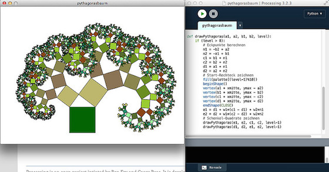

# Der Baum des Pythagoras

Eine weitere Ikone der fraktalen Geometrie ist der [Pythagoras-Baum][0]. Er geht zurück auf den niederländischen Ingenieur und späteren Mathematiklehrer *Albert E. Bosman* (1891–1961). Er entwarf während des 2. Weltkrieges in seiner Freizeit an einem Zeichenbrett, an dem er sonst U-Boot-Pläne zeichnete, geometrische Muster. Seine Graphiken wurden 1957 in dem Buch *»Het wondere onderzoekingsveld der vlakke meetkunde«* veröffentlicht.

Der Pythagoras-Baum beruht auf einer rekursiven Abbildung des Pythagoras-Lehrsatzes: Die beiden Quadrate auf den Katheten des rechtwinkligen Dreiecks dienen als Verzweigung, auf dem jedes Kathetenquadrat sich wiederum verzweigt.

## Die Funktion drawPythagoras

Um die Funktion rekursiv aufrufen zu können, mußte ich sie aus der `draw()`-Funktion auslagern und sie in einen eigenen Aufruf packen:

~~~python
def drawPythagoras(a1, a2, b1, b2, level):
    if (level > 0):
        # Eckpunkte berechnen
        n1 = -b2 + a2
        n2 = -a1 + b1
        c1 = b1 + n1
        c2 = b2 + n2
        d1 = a1 + n1
        d2 = a2 + n2
        # Start-Rechteck zeichnen
        fill(palette[(level-1)%10])
        beginShape()
        vertex(a1 + xmitte, ymax - a2)
        vertex(b1 + xmitte, ymax - b2)
        vertex(c1 + xmitte, ymax - c2)
        vertex(d1 + xmitte, ymax - d2)
        endShape(CLOSE)
        e1 = d1 + w1*(c1 - d1) + w2*n1
        e2 = d2 + w1*(c2 - d2) + w2*n2
        # Schenkel-Quadrate zeichnen
        drawPythagoras(e1, e2, c1, c2, level-1)
        drawPythagoras(d1, d2, e1, e2, level-1)
~~~

Zum Zeichnen der einzelnen Quadrate habe ich nicht die `rect()`-Funktion genutzt, sondern *Shapes*, mit denen sich Punkte zu einem beliebigen Gebilde oder Polygon zusammefassen lassen. Hierzu müssen sie erst einmal mit `beginShape()` und `endShape()` geklammert werden. Darin werden dann mit `vertex(x, y)` nacheinander die einzelnen Punkt aufgerufen, die (im einfachten Fall) durch Linien miteinander verbunden werden sollen. Mit `endShape(CLOSE)` teile ich dem Sketch dann mit, daß das entstehende Polygon auf jeden Fall geschlossen werden soll.

Der Aufruf ist rekursiv: Nachdem zuerst das Grundquadrat gezeichnet wurde, werden die rechten und die linken Schenkelquadrate gezeichnet, die dann wieder als Grundquadrate für den nächsten Rekursionslevel fungieren.

Processing (und damit auch der Python-Mode von Processing) ist gegenüber Rekursionstiefen realtiv robust. Die benutzte Rekursionstiefe von 12 wird klaglos abgearbeitet, auch Rekursionstiefen bis 20 sind -- genügend Geduld vorausgesetzt -- kein Problem. Bei einer Rekursionstiefe von 22 verließ mich aber auf meinem betagten MacBook Pro die Geduld.

## Die Farben

Für die Farben habe ich eine Palette in einer Liste zusammengestellt, die der Reihe nach die Quadrate einfärbt. Da die Liste nur 10 Elemente enthält, habe ich mit `fill(palette[(level-1)%10])` dafür gesorgt, daß nach 10 Leveln die Palette wieder von vorne durchlaufen wird.

## Der Quellcode

Da die eigentliche Aufgabe des Programms in die Funktion `drawPythagoras()` ausgelagert wurde, ist der restlich Quellcode von erfrischender Kürze:

~~~python
palette = [color(189,183,110), color(0,100,0), color(34,139,105),
           color(152,251,152), color(85,107,47), color(139,69,19),
           color(154,205,50), color(107,142,35), color(139,134,78),
           color(139, 115, 85)]

xmax = 600
xmitte = 300
ymax = 440

level = 12
w1 = 0.36   # Winkel 1
w2 = 0.48   # Winkel 2

def setup():
    size(640, 480)
    background(255)
    strokeWeight(1)
    noLoop()

def draw():
    drawPythagoras(-(xmax/10), 0, xmax/20, 0, level)

def drawPythagoras(a1, a2, b1, b2, level):
    if (level > 0):
        # Eckpunkte berechnen
        n1 = -b2 + a2
        n2 = -a1 + b1
        c1 = b1 + n1
        c2 = b2 + n2
        d1 = a1 + n1
        d2 = a2 + n2
        # Start-Rechteck zeichnen
        fill(palette[(level-1)%10])
        beginShape()
        vertex(a1 + xmitte, ymax - a2)
        vertex(b1 + xmitte, ymax - b2)
        vertex(c1 + xmitte, ymax - c2)
        vertex(d1 + xmitte, ymax - d2)
        endShape(CLOSE)
        e1 = d1 + w1*(c1 - d1) + w2*n1
        e2 = d2 + w1*(c2 - d2) + w2*n2
        # Schenkel-Quadrate zeichnen
        drawPythagoras(e1, e2, c1, c2, level-1)
        drawPythagoras(d1, d2, e1, e2, level-1)
~~~

Auch wenn es nicht nötig gewesen wäre, ich mag es einfach (und es dient der Übersichtlichkeit), wenn ich meine Processing.py-Sketche mit `def setup()` und `def draw()` gliedere. Mit `noLoop()` habe ich dann dafür gesorgt, daß die `draw()`-Schleife nur einmal abgearbeitet wird.

## Erweiterungen und Änderungen

Einen »symmetrischen« Pythagoras-Baum erhält man übrigens, wenn man die beiden Winkel-Konstanten `w1` und `w2` jeweils auf `0.5` setzt.

## Credits

Den rekursiven Algorithmus habe ich einem Pascal-Programm aus Jürgen Plate: *[Computergrafik: Einführung – Algorithmen – Programmentwicklung][1]*, München (Franzis) 2.&nbsp;Auflage 1988, Seiten 460-462 entnommen. Und die Geschichte des Baumes steht in dem schon mehrfach erwähnten Buch von Dieter Hermann, *[Algorithmen für Chaos und Fraktale][2]*, Bonn (Addison-Wesley) 1944 auf den Seiten 170f.

[0]: https://de.wikipedia.org/wiki/Pythagoras-Baum
[1]: https://www.amazon.de/Computergrafik-Algorithmen-Programmentwicklung-J%C3%BCrgen-Plate/dp/3772350062/ref=as_li_ss_tl?ie=UTF8&qid=1486231087&sr=8-1&keywords=Computergrafik:+Einf%C3%BChrung+%E2%80%93+Algorithmen+%E2%80%93+Programmentwicklung&linkCode=ll1&tag=derschockwell-21&linkId=1ecefc994bcb34a2eb125fe6b0a584de
[2]: https://www.amazon.de/Algorithmen-Chaos-Fraktale-Dietmar-Herrmann/dp/3893196331/ref=as_li_ss_tl?ie=UTF8&qid=1486231163&sr=8-1&keywords=Algorithmen+f%C3%BCr+Chaos+und+Fraktale&linkCode=ll1&tag=derschockwell-21&linkId=1d9b1f52b6169d24394a3dfc6cc6cf0e
