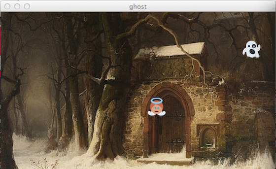

# Rauhnächte: Spaß mit Processing.py

Jeden Winter in den [Rauhnächten][1] treffen sich die Geister mit den Engeln, um gemeinsam zu tanzen und ihrer Freude Ausdruck zu verleihen, daß die Tage nun wieder länger werden. Ich habe das mal in einem kleinen Processing.py-Sketch nachempfunden.

Hier treffen sich Geist und Engelchen vor dem Tor einer Waldkirche oder -kapelle um anmutig Euren Mauszeiger zu umtanzen. Dabei habe ich eine Technik verwendet, die *[Easing][3]* genannt wird. Dabei folgt zwar der *Sprite* dem Mauszeiger, doch bei jedem Durchlauf wird die Distanz zwischen dem Mauszeiger und dem Sprite berechnet und mit einer kleinen Konstante (zum Beispiel 0.05) multipliziert.

~~~python
easing1 = 0.01
easing2 = 0.05

[…]

targetX = mouseX
targetY = mouseY

[…]

engelX += (targetX - engelX) * easing1
engelY += (targetY - engelY) * easing1

[…]

ghostX += (targetX - ghostX) * easing2
ghostY += (targetY - ghostY) * easing2
~~~

Durch die beiden unterschiedlichen Konstanten `easing1` und `easing2` habe ich erreicht, daß die beiden Sprites in unterschiedlichen Geschwindigkeiten und Abständen den Mauszeiger umtanzen.

## Das vollständige Programm

~~~python
easing1 = 0.01
easing2 = 0.05
ghostX = 240
ghostY = 200
engelX = 200
engelY = 240

def setup():
    global bg, ghost, engel
    bg = loadImage("koken.jpg")
    ghost = loadImage("ghost.png")
    engel = loadImage("engel.png")
    frameRate(30)
    size(560, 320)
  
def draw():
    global ghostX, ghostY, engelX, engelY
    background(bg)
    targetX = mouseX
    targetY = mouseY
    
    engelX += (targetX - engelX) * easing1
    if engelX >= (width - 36):
        engelX = width - 36
    elif engelX <= 0:
        engelX = 0;
    engelY += (targetY - engelY) * easing1
    if engelY >= (height - 36):
        engelY = height - 36
    elif engelY <= 0:
        engelY = 0
    image(engel, engelX, engelY)
    
    ghostX += (targetX - ghostX) * easing2
    if ghostX >= (width - 36):
        ghostX = width - 36
    elif ghostX <= 0:
        ghostX = 0;
    ghostY += (targetY - ghostY) * easing2
    if ghostY >= (height - 36):
        ghostY = height - 36
    elif ghostY <= 0:
        ghostY = 0
    image(ghost, ghostX, ghostY)
~~~

Wie Ihr seht, ist da eigentlich nicht viel mehr. Außer dem *Easing* habe ich mit den Randabfragen nur noch dafür gesorgt, daß die beiden Sprites bei ihrem Tänzchen das Programmfenster nicht verlassen.

## Maus versus Tastatur

Die Abfrage der Mausposition funktioniert bei Processing(.py) im Gegensatz zur Tastaturabfrage auch dann, wenn das Programmfenster nicht den Fokus besitzt, sondern auch, wenn die IDE oder andere Fenster noch im Vordergrund sind. Denn die IDE muß sich die Maus ja auch nicht mit dem Programmfenster teilen, die Tastatur aber doch.

## Caveat

Meine ursprüngliche Idee war, statt der Bilder Emojis für Geist und Engel einzusetzen, und zwar diese: 👻 und 👼 , wie ich eine ähnliche Idee schon einmal in einem [P5.js-Sketch][4] umgesetzt hatte. Dann fiel mir jedoch ein, daß Processing.py ja auf [Jython][5] aufsetzt und es daher mit der UTF-8-Unterstützung im Allgemeinen und der Nutzung von Emojis im Besonderen schwierig werden kann (ein aktuelles Jython ist zwar nahezu kompatibel zu Python 2.7, aber eben nicht zu Python 3). Daher habe ich auf die freien ([CC-BY 4.0][6]) [Twemoji-Graphiken von Twitter][7] zurückgegriffen. Hier sind sie, falls Ihr das Beispiel nachprogrammieren wollt.

 

Der Geist sieht zwar nicht ganz so fröhlich aus, wie das Emoji von Apple und anderen, aber es ist vielleicht realistischer. Wenn Männer tanzen (müssen), dann verziehen sie halt oft schmerzhaft ihr Gesicht.

## Weitere Credits

[][8]

Das Tor zur Waldkirche ist ein Ausschnitt aus einem [Gemälde von Edmund Koken][8], das -- da der Maler 1872 verstorben ist -- hinreichend gemeinfrei sein dürfte, so daß Ihr das Bild gefahrlos verwenden könnt.

[1]: https://de.wikipedia.org/wiki/Rauhnacht
[3]: https://processing.org/examples/easing.html
[4]: http://blog.schockwellenreiter.de/2016/07/2016071001.html
[5]: http://cognitiones.kantel-chaos-team.de/programmierung/python/jython.html
[6]: https://creativecommons.org/licenses/by/4.0/
[7]: https://github.com/twitter/twemoji
[8]: http://blog.schockwellenreiter.de/g2016/b201612/201612bild15.html
