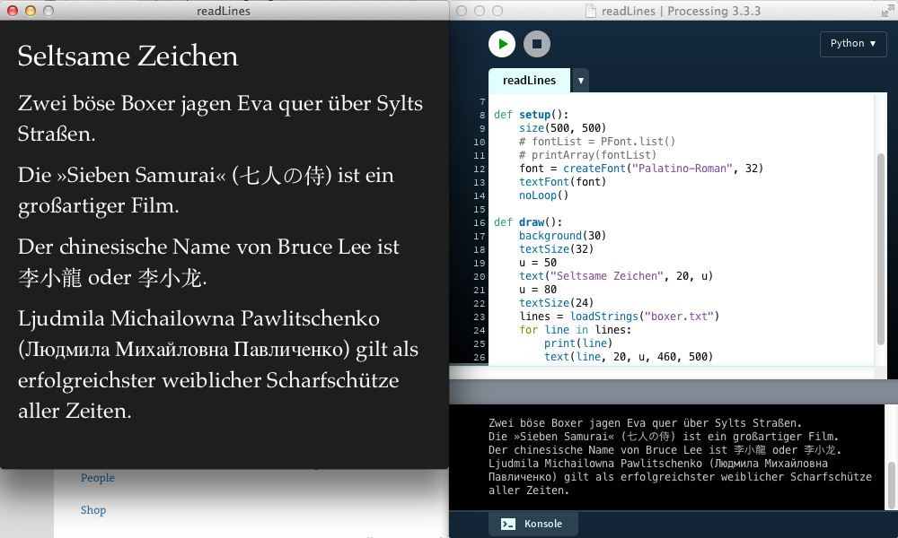

# UTF-8-Text aus Dateien lesen

In der Reference für Processing 3 steht bei allen Datei-Operationen, [so auch bei `loadStrings()`](https://processing.org/reference/loadStrings_.html):

>*Starting with Processing release 0134, all files loaded and saved by the Processing API use UTF-8 encoding. In previous releases, the default encoding for your platform was used, which causes problems when files are moved to other platforms.*

Das ließ hoffen, daß man in Processing.py wenigstens an dieser Stelle ohne das (von mir) ungeliebte `u"utf-8-string"` auskommen kann. Das wollte ich ausprobieren, also legte ich mir als erstes eine (UTF-8-) Textdatei mit diesem Inhalt an:

Das sieht doch schon sehr gefährlich aus, in der ersten Zeile die bösen deutschen Umlaute, die zweite Zeile mit japanischen Schriftzeichen, die dritte enthält chinesische Glyphen und die letzte Zeile kyrillische (russische) Zeichen. Noch vor wenigen Jahren hätte das jeden Programmierer an den Rand des Wahnsinns gebracht, aber nun: Selbst dieser simple Dreizeiler

~~~python
lines = loadStrings("boxer.txt")
for line in lines:
    print(line)
~~~

gibt den Text mit allen Sonderzeichen auf der Konsole aus. Und auch der Befehl `text(line, x, y, w, h)` hat keine Schwierigkeiten (einen UTF-8-fähigen Font vorausgesetzt) diesen Text in das Processing-Fenster zu zaubern. Hier das Progrämmchen, das obigen Screenshot produziert:

~~~python
font = None

def setup():
    size(500, 500)
    # fontList = PFont.list()
    # printArray(fontList)
    font = createFont("Palatino-Roman", 32)
    textFont(font)
    noLoop()

def draw():
    background(30)
    textSize(32)
    u = 50
    text("Seltsame Zeichen", 20, u)
    u = 80
    textSize(24)
    lines = loadStrings("boxer.txt")
    for line in lines:
        print(line)
        text(line, 20, u, 460, 500)
        u += 80
~~~

Die beiden auskommentierten Zeilen listen in der Konsole alle auf dem System verfügbaren Fonts auf, mit dem Namen, in dem sie mit `createFont()` in Processing angesprochen werden können. Wenn man einen dieser Fonts verwendet, erspart das zwar einerseits die Installation eines Fonts im `data`-Ordner, macht aber auf der anderen Seite solch ein Skript weniger portabel, denn was ist, wenn der Empfänger diesen Font nicht installiert hat.

## Keine Emojis

In einer ersten Version des Textes hatte ich auch noch ein paar Emojis hineingeschmuggelt. Hier wurde aber eine Grenze überschritten, Emojis wurden weder in der Konsole noch auf dem Canvas angezeigt (man kann sie auch nicht per *Copy & Paste*) in den Editor schmuggeln auch nicht mit `u"💀"`. Das gilt aber auch für den Java-Mode von Processing, Emojis sind erst in P5.js in der Welt von Processing vorgesehen.

## Caveat

Auch wenn ich es natürlich schön finde, daß das ungeliebte `u"utf-8-string"` bei den Dateioperationen mit Processing-Befehlen wegfällt, ist es natürlich inkonsistent. Denn Dateioperationen mit Python-Befehlen arbeiten natürlich weiterhin mit der besonderen UTF-8-Kodierung von Python 2.7, so zum Beispiel die Befehle um CSV- oder JSON-Dateien zu lesen und zu schreiben. Daher ist eine gewisse Vorsicht angebracht.

