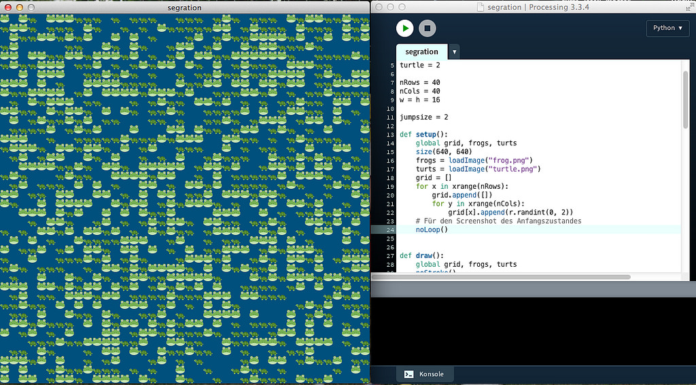

# Frösche und Schildkröten oder: Wie entsteht Segregation?

[Mitchel Resnick](https://de.wikipedia.org/wiki/Mitchel_Resnick) erzählt uns eine nette Geschichte: In einem Teich lebten Frösche und Schildkröten in trauter Eintracht zusammen. Jeder Frosch lebt auf einer Seerose und hat auf den acht benachbarten anliegenden Seerosen je vier Frösche und je vier Schildkröten als Nachbarn. (Man erkennt leicht, daß es sich um quadratische Seerosen mit einer [Moore-Nachbarschaft](http://cognitiones.kantel-chaos-team.de/programmierung/softcomputing/moorenb.html) handelt.) Doch eines Tages kommt ein böser Sturm auf und wirbelt alles durcheinander und auch etliche Frösche und Schildkröten kommen (zu gleichen Teilen) dabei um. Als sich der Sturm gelegt hat, versuchen die Tiere sich wieder zu organisieren und es sich auf den Seerosen gemütlich zu machen. Sie sind jedoch nur glücklich, wenn sie mindestens drei Nachbarn haben, die der gleichen Spezies angehören, ansonsten versuchen sie, eine andere, freie Seerose zu besiedeln. Und was passiert dabei? Es entstehen Kolonien, die nur von Schildkröten und andere Kolonien, die nur von Fröschen bevölkert werden. Eine vorbeifliegende Eule wundert sich und fragt einen Frosch, ob sie sich denn nicht mehr lieb haben würden. »Doch, wir haben uns lieb wie eh und je. Nur … es passiert einfach, daß wir zusammenziehen, unter der einzigen Voraussetzung, daß wir mindestens drei Nachbarn unserer Spezies haben wollen. Und den Schildkröten geht es genauso.«

## Schauen wir uns das doch einfach einmal an:

*Segregationsspiel (Startzustand)*

Resnick hat das natürlich in [StarLogo](http://cognitiones.kantel-chaos-team.de/programmierung/starlogo.html) programmiert, ich habe ein leicht abgewandeltes Processing.py-Programm geschrieben, mit dem man das Verhalten untersuchen kann. Beim Start verteilen wir zufällig die Schildkröten und Frösche zu gleichen Teilen auf einem 40x40-Raster, wobei etwa 30 Prozent leer bleiben, damit sich die Viecher auch bewegen können. In jedem Durchlauf wird zufällig ein Bewohner ausgewählt und er wird gefragt, ob er glücklich sei. Glücklich ist er nur, wenn er wenigstens drei Nachbarn hat, die der gleichen Spezies angehören. Ist er glücklich, bleibt er da sitzen wo er ist. Ist er unglücklich, sucht er zufällig in der Nachbarschaft in seiner Sprungdistanz (ja, in meiner Geschichte können auch Schildkröten springen) eine Seerose aus. Ist diese Seerose frei, springt er dahin, hoffend, dort glücklich zu werden. Ist das Feld nicht frei, bleibt er hocken und hofft auf eine neue Chance, wieder ausgewürfelt zu werden.

*Segregationsspiel (nachdem es ungefähr eine halbe Stunde gelaufen ist)*

Läßt man diese Simulation nun laufen, stellt man fest, daß sich tatsächlich Cluster gleicher Spezies bilden. Die kleinste stabile Einheit ist ein Quadrat mit der Kantenlänge zwei – hier hat jeder mindestens drei Nachbarn. Außerdem ist eine Flucht von den Rändern weg zu beobachten. Hier habe ich einfach angenommen, daß das Wasser so flach ist, daß dort keine Seerosen gedeihen – die Ränder werden also nicht periodisch fortgesetzt. Und so hat man an den Rändern natürlich weniger Nachbarn und die Chance, glücklich zu sein, ist geringer.

Außerdem kann es vorkommen, daß einzelne Tiere regelrecht von der benachbarten Spezies eingekesselt werden und sie nicht mehr fliehen können. Die Armen sind zu einem ewigen Unglücklichsein verdammt. Hier hilft nur, die maximale Sprungdistanz zu erhöhen.

Überhaupt: Obige Screenshots stammen von einem Sketch mit einer Sprungdistanz von zwei, nachdem der Sektch etwa eine halbe Stunde gelaufen war. Es passiert nicht mehr viel. Die meisten zufällig ausgewählten in einer Runde sind glücklich und verharren auf ihren Platz. Nur noch wenige Exemplare einer Gattung irren umher und suchen Anschluß. Andere sind enteder vom Rand des Teiches oder von den Spezies der anderen Art eingekesselt und zu ewigem unglücklich sein verdammt.

Erhöht man aber den Wert der Sprungdistanz (zum Beispiel auf fünf), dann geht nicht nur die Clusterbildung schneller vonstatten, sondern auch die Zahl der eingekesselten Tiere geht massiv zurück.

Was uns dieses einfache Programm über die tatsächliche [Segregation](https://de.wikipedia.org/wiki/Segregation_(Soziologie)) erzählt, überlasse ich aber der Phantasie meiner Leserinnen und Leser.

## Der Quellcode

~~~python
import random as r

empty = 0
frog = 1
turtle = 2

nRows = 40
nCols = 40
w = h = 16

jumpsize = 2

def setup():
    global grid, frogs, turts
    size(640, 640)
    frogs = loadImage("frog.png")
    turts = loadImage("turtle.png")
    grid = []
    for x in xrange(nRows):
        grid.append([])
        for y in xrange(nCols):
            grid[x].append(r.randint(0, 2))
    # Für den Screenshot des Anfangszustandes
    # noLoop()
            

def draw():
    global grid, frogs, turts
    noStroke()
    background(0, 80, 125)
    
    for x in xrange(nRows):
        for y in xrange(nCols):
            if grid[x][y] == empty:
                fill(0, 80, 125)
                rect(x*w, y*h, w, h)
            elif grid[x][y] == frog:
                image(frogs, x*w, y*h, w, h)
            elif grid[x][y] == turtle:
                image(turts, x*w, y*h, w, h)
            else:
                println("Etwas ist falsch im Staate Lilypond!")
                
    actorX = r.randint(0, nRows-1)
    actorY = r.randint(0, nCols-1)
    # Lebt hier jemand?
    if grid[actorX][actorY] > 0:
        # Und ist er glücklich?
        happy = isHappy(grid[actorX][actorY], actorX, actorY)
        # Wenn nicht, dann möglichst weg von hier
        if not(happy):
            newX = r.randint(-jumpsize, jumpsize)
            newY = r.randint(-jumpsize, jumpsize)
            newX += actorX
            newY += actorY
            # Liegt mein Ziel noch im Teich?
            if ((newX >= 0) and (newX < nRows) and (newY >= 0) and (newY < nCols)):
                if grid[newX][newY] == empty:
                    grid[newX][newY] = grid[actorX][actorY]
                    grid[actorX][actorY] = empty

def isHappy(animal, x, y):
    happy = 0
    if (y-1 > 0) and (grid[x][y-1] == animal):
        happy += 1
    if (x+1 < nRows) and (y-1 > 0) and (grid[x+1][y-1] == animal):
        happy += 1
    if (x+1 < nRows) and (grid[x+1][y] == animal):
        happy += 1
    if (x+1 < nRows) and (y+1 < nCols) and (grid[x+1][y+1] == animal):
        happy += 1
    if (y+1 < nCols) and (grid[x][y+1] == animal):
        happy += 1
    if (x-1 > 0) and (y+1 < nCols) and (grid[x-1][y+1] == animal):
        happy += 1
    if (y+1 < nCols) and (grid[x][y+1] == animal):
        happy += 1
    if (x-1 > 0) and (grid[x-1][y] == animal):
        happy += 1
    if happy >= 3:
        return True
    else:
        return False
~~~

Die Bilder von Frosch und Schildkröte habe ich den [Twitter-Emojis](https://github.com/twitter/twemoji) entnommen und hier sind sie noch einmal, damit Ihr das Spiel nachprogrammieren könnt:

 

In Processing (Java) hatte ich vor Jahren diese Simulation auch schon einmal [programmiert](http://cognitiones.kantel-chaos-team.de/programmierung/creativecoding/processing/froescheundschildkroeten.html).

## Literatur

- Mitchel Resnick: *[Turtles, Termites, and Traffic Jams: Explorations in Massively Parallel Microworlds](http://www.amazon.de/gp/product/0262680939/ref=as_li_ss_tl?ie=UTF8&camp=1638&creative=19454&creativeASIN=0262680939&linkCode=as2&tag=derschockwell-21)*, Cambridge, MA (MIT Press) 1997, p. 81 - 88