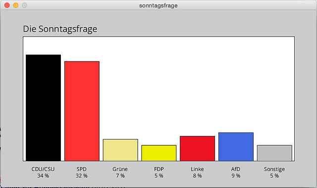

# Visualisierung: Die Sonntagsfrage

Man kann sich durchaus zu Recht fragen, ob es überhaupt sinnvoll ist, so etwas wie den obigen Barchart in Processing.py per Fuß zu erstellen. Schließlich gibt es (auch in Python) Bibliotheken wie etwa die [Matplotlib](http://cognitiones.kantel-chaos-team.de/programmierung/python/matplotlib.html), die für diese Aufgabe spezialisiert sind und mit wenigen Zeilen Code wunderbarer Graphiken auf den Monitor zaubern und sie auch gleichzeitig publikationsreif in einer Datei ablegen können.

Aber auf der anderen Seite schadet es nichts, wenn man selber genau weiß, wie man so etwas anstellen kann. Denn zum einem hat man vielleicht Gründe, die Umgebung von Processing.py nicht verlassen zu wollen. Und zum anderen gibt es doch auch immer wieder Spezialfälle, die von den spezialisierten Bibliotheken nicht abgedeckt werden.

Daher habe ich hier einmal die Ergebnisse der Sonntagsfrage (»Wenn am nächsten Sonntag Bundestagswahl wäre …«), die die *Forschungsgruppe Wahlen* am 10. März dieses Jahres veröffentlicht hat, nur mit den Hausmitteln von Processing.py in einem einfachen Barchart dargestellt.

Für die Daten, Namen und Farben habe ich drei Listen erstellt. Das hat den Vorteil, daß man bei einer neuen Umfrage nur die Ergebnisse in der Liste `prozente[]` ändern muß -- an den anderen Listen ändert sich zumindest bis zur Bundestagswahl im nächsten Jahr nichts.

Normalerweise werden Rechtecke in Processing ja mit dem Befehl `rect(x, y, w, h)` erzeugt, setzt man jedoch `rectMode(CORNERS)`, dann werden die realen Eckpunkte als Parameter erwartet, also `rect(x1, y1, x2, y2)`.

Für die Anpassung der Balken an den Bildschirmausschnitt habe ich auf Processings `map(value, dataMin, dataMax, targetMin, targetMax)`-Funktion zurückgegriffen, die einen Datenwert von einem Bereich in einen anderen überträgt. Nun hat Python selber aber auch noch eine eingebaute `map(function, iterable, …)`-Funktion, die mit der Processing-Funktion in Konflikt steht. Aber die Macher von Processing.py haben sich viel Mühe gegeben, diesen Konflikt aufzulösen. Erfüllt `map()` die Signatur der Python-Funktion, wird diese aufgerufen, ansonsten die Processing-Funktion.

## Der Quellcode

~~~python
parteien = ["CDU/CSU", "SPD", u"Grüne", "FDP", "Linke", "AfD", "Sonstige"]
prozente = [34, 32, 7, 5, 8, 9, 5]
farben = [color(0, 0, 0), color(255, 48, 48), color(240, 230, 140),
          color(238, 238, 0), color(238, 18, 37),
          color(65, 105, 225), color(190, 190, 190)]

titel = "Die Sonntagsfrage"

def setup():
    global X1, X2, Y1, Y2
    size(720, 405)
    X1 = 50
    X2 = width - X1
    Y1 = 60
    Y2 = height - Y1
    font1 = createFont("OpenSans-Regular.ttf", 20)
    textFont(font1)
    noLoop()

def draw():
    global X1, X2, Y1, Y2
    fill(255)
    rectMode(CORNERS)
    rect(X1, Y1, X2, Y2)
    fill(0)
    textSize(20)
    text(titel, X1, Y1 - 10)
    delta = (X2 - X1)/(len(prozente))
    w = delta*0.9
    x = w*1.22
    textSize(12)
    for i in range(len(prozente)):
        # Balken zeichnen
        h = map(prozente[i], 0, 40, Y2, Y1)
        fill(farben[i])
        rect(x - w/2, h, x + w/2, Y2)
        # Parteinamen und Prozente unter der X-Achse
        textAlign(CENTER, TOP)
        fill(0)
        text(parteien[i], x, Y2 + 10)
        text(str(prozente[i]) + " %", x, Y2 + 25)
        x += delta
~~~

Ansonsten ist der Quellcode leicht nachzuvollziehen. Die Abstands- und Längenwerte für `w` und `delta` habe ich durch Experimentieren herausgefunden, ebenso die Startposition von `x`.

## Quellen

Die Zahlen der *Forschungsgruppe Wahlen* habe ich auf der Seite [wahlrecht.de](http://www.wahlrecht.de/umfragen/index.htm) entnommen, dort sind viele weitere Umfrageergebnisse zu Bundes- und Landtagswahlen zu finden. Und den verwendeten Font [Open Sans](https://fonts.google.com/specimen/Open+Sans) habe ich bei Google Fonts gefunden. Er steht unter der [Apache-Lizenz, Version 2](http://www.apache.org/licenses/LICENSE-2.0). Ihr solltet nicht vergessen, die entsprechende Datei `OpenSans-Regular.ttf` in den `data`-Folder Eures Sketches zu schieben, damit Processing.py den Font auch finden kann.